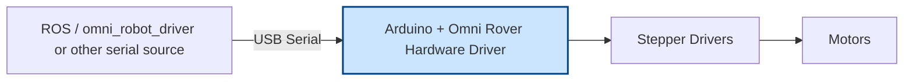

# Omni Rover Hardware Driver

## Overview

The **Omni Rover Hardware Driver** is the **low-level firmware** for an omni-directional rover with mecanum wheels, powered by stepper motors and controlled by an Arduino.
It is designed to work **in conjunction with the [omni\_robot\_driver](https://github.com/bottad/omni_robot_driver)** ROS package, which handles high-level control, navigation, and joystick input.

While the firmware is optimized for use with the ROS driver, **input commands can be sent by any source** as long as they follow the same message protocol and are transmitted over the serial connection (USB or UART). This allows integration with custom controllers, scripts, or other non-ROS systems.

This firmware is responsible for:

* Receiving velocity and mode commands from the ROS driver via serial.
* Translating Cartesian and angular velocities into individual wheel stepper speeds.
* Driving the stepper motors using the [AccelStepper](https://www.airspayce.com/mikem/arduino/AccelStepper/) library.
* Monitoring battery voltage and periodically reporting it to ROS.
* Displaying motion feedback on the Arduino LED Matrix.
* Enforcing safety via a watchdog timer.

---

## System Architecture




### Pin Configuration

| Function              | Pin     |
| --------------------- | ------- |
| Motors Enable         | 8       |
| Motor L2 Step / Dir   | 2 / 5   |
| Motor L1 Step / Dir   | 3 / 6   |
| Motor R2 Step / Dir   | 4 / 7   |
| Motor R1 Step / Dir   | 12 / 13 |
| Battery Voltage Sense | A0      |
| LED (built-in)        | 13      |

---

## Communication Protocol

The firmware communicates with the host (ROS driver or manual terminal) via **serial messages** framed with start/end symbols:

```
<START_SYMBOL><Command_Type><Content><END_SYMBOL>
```

Where:

* **START_SYMBOL** = `$`
* **END_SYMBOL** = `\n`
* **Command_ype** = One character
* **Content** = ASCII or binary data depending on the command

### Command Types

| Code | Name             | Direction | Description                      |
| ---- | ---------------- | --------- | -------------------------------- |
| `M`  | Message          | → PC      | Generic ASCII message            |
| `S`  | Super Command    | ← PC      | Switch operating mode            |
| `V`  | Velocity Command | ← PC      | Set robot velocities (vx, vy, ω) |
| `B`  | Battery Voltage  | → PC      | Report battery voltage (mV)      |
| `E`  | Error            | → PC      | Error message                    |

---

### Example Commands

**Velocity Command** – Move at 2.0 m/s (X), 1.0 m/s (Y), 0.5 rad/s (rotation):

```
$V20,10,5\n
```

**Super Command** – Switch to velocity control mode:

```
$S1\n
```

**Battery Report** – Sent automatically every 5 seconds:

```
$B7400\n
```

→ 7.4 V battery

**Error Message**:

```
$EInvalid command\n
```

---

## Safety Features

* **Watchdog timeout**: Motors stop if no `S` or `V` command is received within 500 ms.
* **Mode enforcement**: Velocity commands are only applied when in `MODE_VELOCITY`.
* **Voltage monitoring**: Battery readings sent every 5 s.

---

## Setup & Usage

1. **Hardware wiring**: Connect motors and drivers according to the **Pin Configuration** table.
2. **Check Settings**: Ensure hardware_config.hpp resembles hardware setup (eg. microsteps, max_speed ...)
2. **Upload firmware**: Compile and upload this code to your Arduino.
3. **Connect to ROS**:

   * Install and run the [omni\_robot\_driver](https://github.com/bottad/omni_robot_driver) package.
   * Set the correct serial port in the ROS driver configuration.
4. **Run control**: Send velocity/mode commands from ROS or a serial terminal.
